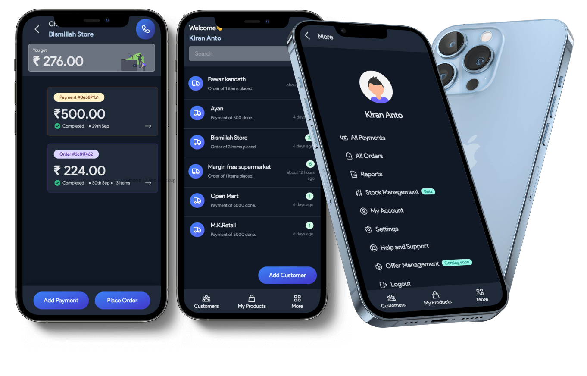
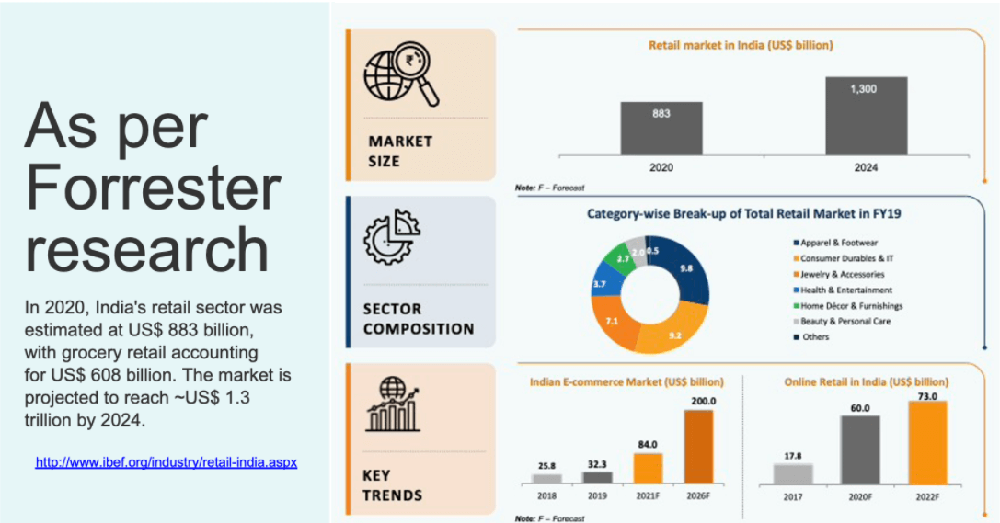
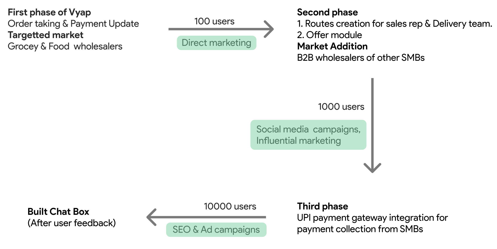

import { Appear, Head } from 'mdx-deck'
import { FullScreenCode, Invert, Split } from 'mdx-deck/layouts'

export { default as theme } from './theme'

<Head>
  <title>Vyap Pitchdeck</title>
  <link rel="icon" href="./assets/vyap.png" sizes="32x32" />
  <meta itemProp="name" content="Vyap Pitchdeck" />
  <meta itemProp="description" content="Awesome Vyap Pitchdeck" />
  <meta itemProp="image" content="./assets/vyap.png" />
  <meta name="twitter:card" content="summary_large_image" />
  <meta name="twitter:site" content="@kirananto" />
  <meta name="twitter:title" content="Vyap Pitchdeck" />
  <meta name="twitter:description" content="Awesome Vyap Pitchdeck" />
  <meta name="twitter:image" content="./assets/vyap.png" />
  <meta property="og:title" content="Vyap Pitchdeck" />
  <meta property="og:type" content="article" />
  <meta property="og:url" content="https://vyap-pitchdeck.netlify.app/" />
  <meta property="og:image" content="./assets/vyap.png" />
  <meta property="og:description" content="Awesome Vyap Pitchdeck" />
  <meta property="og:site_name" content="Vyap Pitchdeck" />
  <meta property="article:published_time" content="2013-09-17T05:59:00+01:00" />
  <meta property="article:modified_time" content="2013-09-16T19:08:47+01:00" />
  <meta property="article:section" content="Article Section (React? Design?)" />
</Head>

*Helping wholesalers to reach all retailers in one place.*

---

export default Invert

# Problem & Opportunity 🤔

- Even in 2021, Wholesalers still have an old school pen and paper inventory order-taking process from SMB’s
- Wholesalers update payment collected from their retailers in the ledger. So find it difficult to manage it.

---

# What is the solution ? 💡

Vyap is a chat-like app, which works as a local inventory network connecting wholesalers with local retailers
 where wholesalers can manage all their retailers in one place.

---

# So how does the product look like ? ✨

---

export default Invert

Wholesalers can add products, list their retailers and 

then create orders and update payments of each retailer.

---

# Business model & Market size 📈

Market data that suggests a much larger opportunity 

if we can figure out how to monetize it.

---

# How do we make money ? 💰

Check next slide 👉

---

export default Invert

## Subscription charges 🔔

App subscription charges from Wholesalers & Retailers

---

## Integrated payments 💳

Vyap will take a revenue cut from the transactions made.

---

export default Invert

## Add-on subscription 🔔

Subscription charges from the plugins/features activated

---

---

# So who are our competitors ? 🏆

  
**Udaan** will be our direct competitor in b2b marketplace 

space but their approach leaves room for us.

Other competitors includes **Indiamart**, **JDmart** and **AmazonBusiness**

---

# What are our advantages ? ✅

- We help wholesalers to connect nearby retailers by providing technology for their old school pen and paper inventory order-taking process.
- We help their retailers also with a login so that they can also view their orders, payment history, and deals.

---

export default Invert

# What does the timeline look like ?  📅

- **June 2021** - Validated idea with 50 different wholesalers
- **July 2021** - Launched our beta
- **September 2021** - First 50 beta users with 100 transactions per day
- **October 2021** - First phase Product launched

---

# How do we hyper scale ? 📈

Achieve scale over the next 18 months by developing features for 

different B2B wholesalers for SMBs and target other

manufacturers who sells inventories directly to retailers.

---

---

# How does the team look like ? 💼

 

# 👨‍💼
## Abdulla Jazeem
**Co-founder & CEO**

Jazeem leads product and business development at vyap. Previously built 4money, a dashboard for small shops where they can do mobile payments, tv payments, money transfers, bill payments among other things. More than 10000 shops are using it withannual GMV of $10 million.

# 👨‍💼

## Kiran Anto
**Co-founder & CTO**

Kiran leads the engineering team building vyap. He has more than 3 years of experience in building scalable web applications in a wide variety of domains. Previously worked at Esper, the first Android DevOps Platform Headquartered at Bellevue, WA.

# 👨‍💼

## Sameer
**Co-founder & COO**

Sameer manages the operations team at Vyap. He is the industry expert with morethan 7 years experience. Previously co-founded 4money.

---

# Thank you 👋